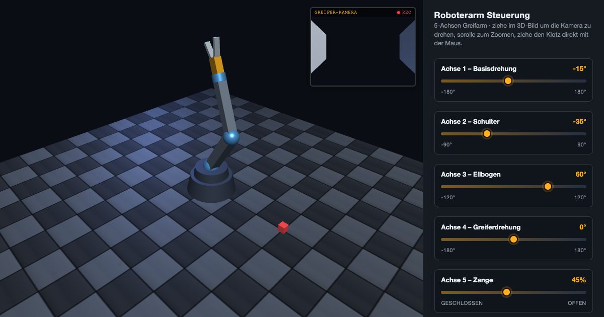

# 5-Achsen Roboterarm Simulator

Ein browserbasierter Simulator für einen 5-achsigen Greifarm, gebaut mit [three.js](https://threejs.org/). Alles steckt in einer einzigen Datei (`robot-arm.html`) – kein Build-Schritt, keine Abhängigkeiten außer der three.js-CDN.



## Funktionen

- **5 Achsen** einzeln über Regler steuerbar: Basisdrehung, Schulter, Ellbogen, Greiferdrehung und Zange (öffnen/schließen).
- **Greifbarer Klotz** auf dem Boden, der aufgenommen, transportiert und wieder abgelegt werden kann.
- **Kollisionserkennung** zwischen Greifer, Boden und Klotz – eine Bewegung, die tiefer in eine Kollision hineinführen würde, wird blockiert; nur ein Zurückfahren ist erlaubt.
- **Kamera am Greifer** montiert, mittig zwischen den Zangenbacken; das Live-Bild erscheint im kleinen Monitor oben rechts.
- **Schachbrett-Boden** aus prozedural erzeugten Stahlplatten mit Fugenlinien und Rostspuren.
- **Pick-up-Demo per Knopfdruck**: Der Arm fährt langsam (eine Achse nach der anderen, je 2 Sekunden) zum Klotz, greift ihn, legt ihn an anderer Stelle ab – begleitet von einem akustischen Sicherheits-Warnton.

## Verwendung

Die Datei `robot-arm.html` direkt im Browser öffnen, zum Beispiel:

```bash
open robot-arm.html
```

Oder über einen lokalen Webserver bereitstellen (Port 5000 vermeiden, da er unter macOS von AirPlay belegt ist):

```bash
python3 -m http.server 8000
```

Anschließend `http://localhost:8000/robot-arm.html` im Browser aufrufen.

**Bedienung:**

- Mit der Maus im 3D-Bild ziehen, um die Kamera zu drehen; scrollen zum Zoomen.
- Den roten Klotz direkt mit der Maus verschieben, solange er nicht gegriffen ist.
- Zum Greifen: Zange schließen (Achse 5 nahe 0 %), während die Greiferspitze nah am Klotz ist.
- Zum Loslassen: Zange öffnen.
- „Pick-up starten“ löst die automatische Demo aus; „Reset“ setzt Arm und Klotz auf die Ausgangsposition zurück (bricht eine laufende Demo ab).

## Struktur

- `robot-arm.html` – die komplette Anwendung (3D-Szene, Kinematik, Kollisionslogik, UI, Demo).
- `prompt.md` – Protokoll der Prompts, mit denen dieses Projekt schrittweise entwickelt wurde.
- `CLAUDE.md` – technische Hinweise für die Weiterentwicklung mit Claude Code.
